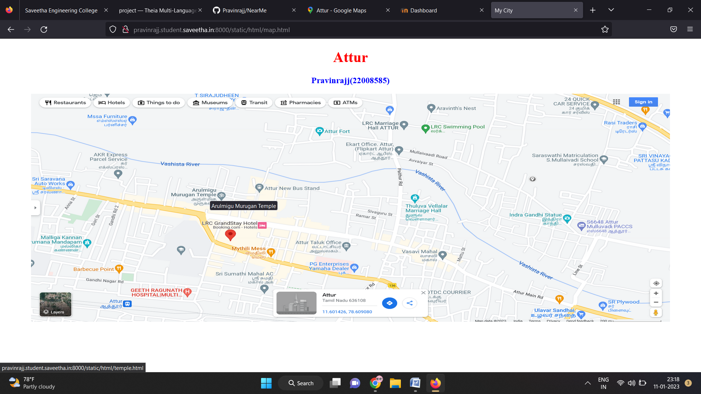
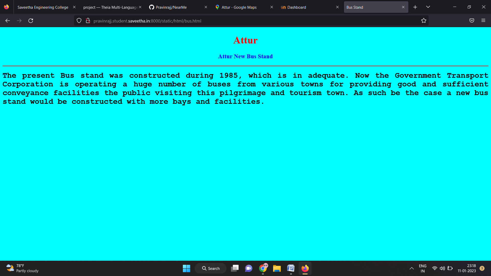
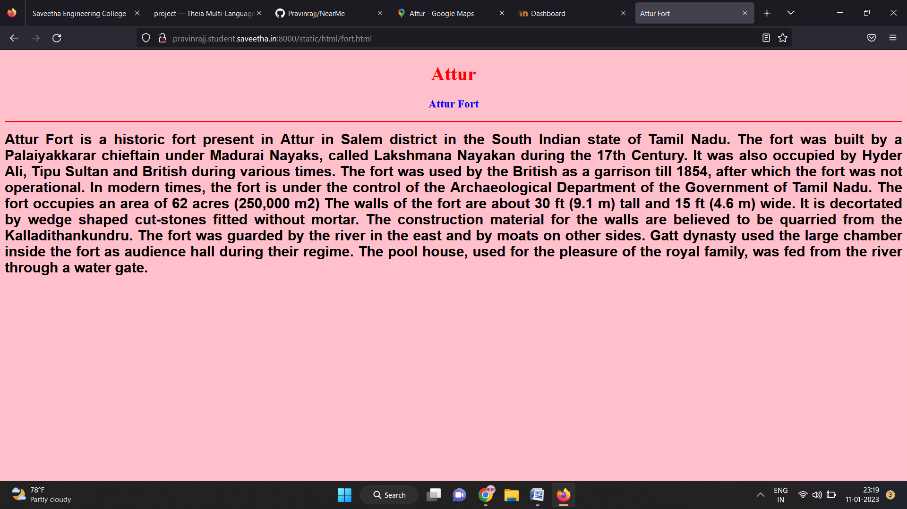
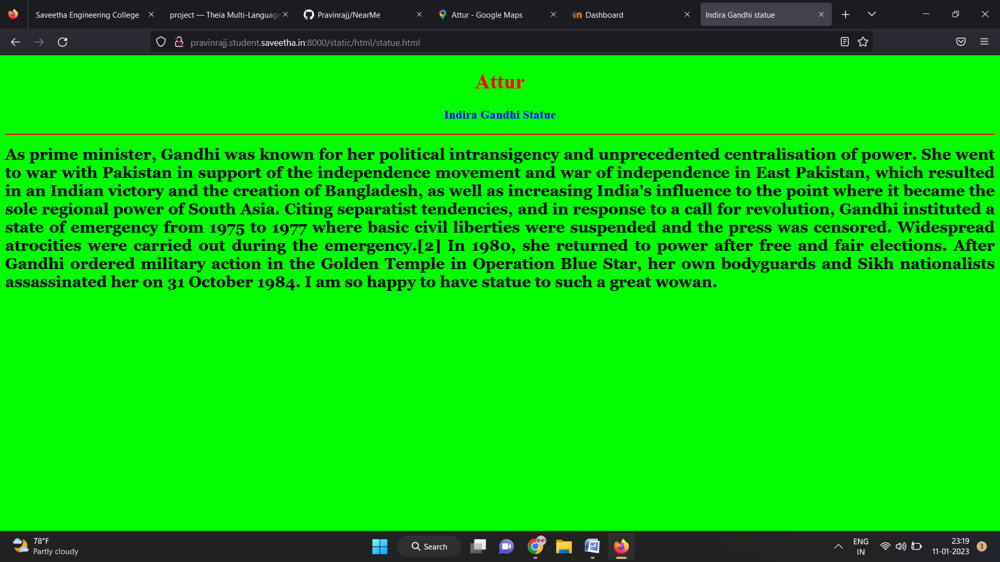
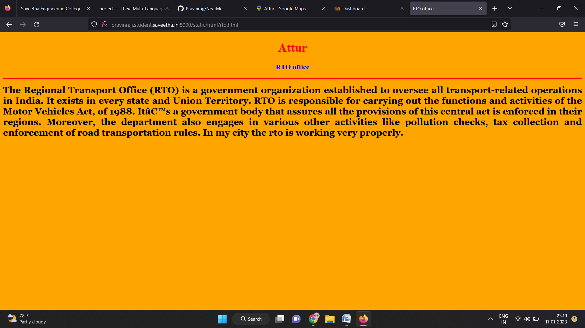
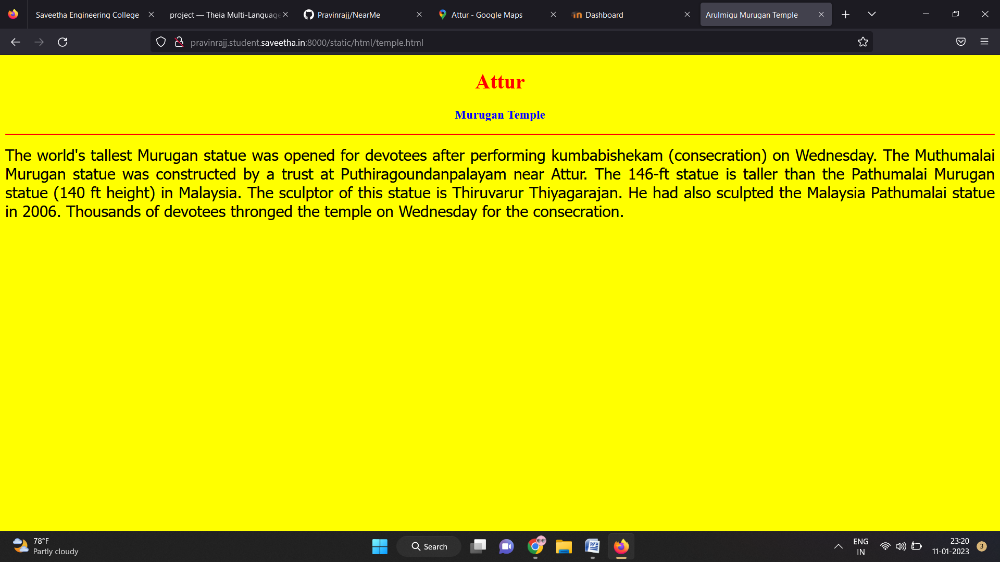
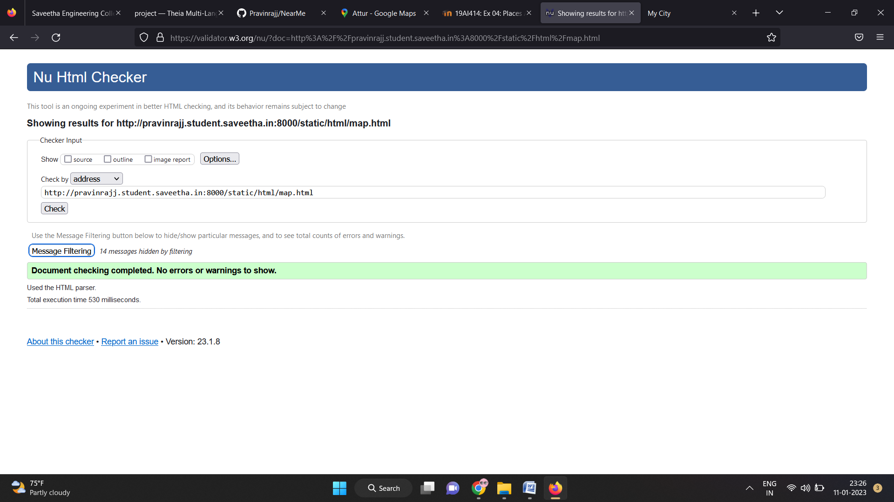

# Places Around Me
## AIM:
To develop a website to display details about the places around my house.

## Design Steps:

### Step 1:
Create a new repository in the github.

### Step 2:
Clone the repository in github from the student server.

### Step 3:
Create the html codes and execute them with the help of student server.

### Step 4:
Verify with your coordinates and submit them.

## Code:

```
map.html

<!DOCTYPE html>
<html lang="en">
<head>
<title>My City</title>
</head>
<body>
<h1 align="center">
<font color="red"><b>Attur</b></font>
</h1>
<h3 align="center">
<font color="blue"><b>Pravinrajj(22008585)</b></font>
</h3>
<center>

<map name="MyCity">
<area shape="circle" coords="400,200,20" href="/static/html/temple.html" title="Arulmigu Murugan Temple">
<area shape="rectangle" coords="230,30,260,60" href="/static/html/bus.html" title="Bus Stand">
<area shape="circle" coords="400,350,50" href="/static/html/fort.html" title="Attur Fort">
<area shape="circle" coords="490,500,75" href="/static/html/rto.html" title="RTO office">
<area shape="rectangle" coords="490,150,870,320" href="/static/html/statue.html" title="Indira Gandhi Statue">
</map>
</center>
</body>
</html>

bus.html

<!DOCTYPE html>
<html lang="en">
<head>
<title>Bus Stand</title>
</head>
<body bgcolor="cyan">
<h1 align="center">
<font color="red"><b>Attur</b></font>
</h1>
<h3 align="center">
<font color="blue"><b>Attur New Bus Stand</b></font>
</h3>
<hr size="3" color="red">
<p align="justify">
<font face="Courier New" size="5">
<b>
The present Bus stand was constructed during 1985, which is in adequate. Now the Government Transport Corporation is operating a huge number of buses from various towns for providing good and sufficient conveyance facilities the public visiting this pilgrimage and tourism town. As such be the case a new bus stand would be constructed with more bays and facilities.
</b>
</font>
</p>
</body>
</html>

temple.html

<!DOCTYPE html>
<html lang="en">
<head>
<title>Arulmigu Murugan Temple</title>
</head>
<body bgcolor="yellow">
<h1 align="center">
<font color="red"><b>Attur</b></font>
</h1>
<h3 align="center">
<font color="blue"><b>Murugan Temple</b></font>
</h3>
<hr size="3" color="red">
<p align="justify">
<font face="Tahoma" size="5">
The world's tallest Murugan statue was opened for devotees after performing kumbabishekam (consecration) on Wednesday. The Muthumalai Murugan statue was constructed by a trust at Puthiragoundanpalayam near Attur.
The 146-ft statue is taller than the Pathumalai Murugan statue (140 ft height) in Malaysia. The sculptor of this statue is Thiruvarur Thiyagarajan. He had also sculpted the Malaysia Pathumalai statue in 2006. Thousands of devotees thronged the temple on Wednesday for the consecration.
</font>
</p>
</body>
</html>

fort.html

<!DOCTYPE html>
<html lang="en">
<head>
<title>Attur Fort</title>
</head>
<body bgcolor="pink">
<h1 align="center">
<font color="red"><b>Attur</b></font>
</h1>
<h3 align="center">
<font color="blue"><b>Attur Fort</b></font>
</h3>
<hr size="3" color="red">
<p align="justify">
<font face="Arial" size="5">
<b>
Attur Fort is a historic fort present in Attur in Salem district in the South Indian state of Tamil Nadu. The fort was built by a Palaiyakkarar chieftain under Madurai Nayaks, called Lakshmana Nayakan during the 17th Century. It was also occupied by Hyder Ali, Tipu Sultan and British during various times. The fort was used by the British as a garrison till 1854, after which the fort was not operational. In modern times, the fort is under the control of the Archaeological Department of the Government of Tamil Nadu. The fort occupies an area of 62 acres (250,000 m2) The walls of the fort are about 30 ft (9.1 m) tall and 15 ft (4.6 m) wide. It is decortated by wedge shaped cut-stones fitted without mortar. The construction material for the walls are believed to be quarried from the Kalladithankundru. The fort was guarded by the river in the east and by moats on other sides. Gatt dynasty used the large chamber inside the fort as audience hall during their regime. The pool house, used for the pleasure of the royal family, was fed from the river through a water gate.
</b>
</font>
</p>
</body>
</html>

rto.html

<!DOCTYPE html>
<html lang="en">
<head>
<title>RTO office</title>
</head>
<body bgcolor="orange">
<h1 align="center">
<font color="red"><b>Attur</b></font>
</h1>
<h3 align="center">
<font color="blue"><b>RTO office</b></font>
</h3>
<hr size="3" color="red">
<p align="justify">
<font face="Georgia" size="5">
<b>
The Regional Transport Office (RTO) is a government organization established to oversee all transport-related operations in India. It exists in every state and Union Territory. RTO is responsible for carrying out the functions and activities of the Motor Vehicles Act, of 1988. It’s a government body that assures all the provisions of this central act is enforced in their regions. Moreover, the department also engages in various other activities like pollution checks, tax collection and enforcement of road transportation rules. In my city the rto is working very properly.
</b>
</font>
</p>
</body>
</html>

statue.html

<!DOCTYPE html>
<html lang="en">
<head>
<title>Indira Gandhi statue</title>
</head>
<body bgcolor="lime">
<h1 align="center">
<font color="red"><b>Attur</b></font>
</h1>
<h3 align="center">
<font color="blue"><b>Indira Gandhi Statue</b></font>
</h3>
<hr size="3" color="red">
<p align="justify">
<font face="Georgia" size="5">
<b>
As prime minister, Gandhi was known for her political intransigency and unprecedented centralisation of power. She went to war with Pakistan in support of the independence movement and war of independence in East Pakistan, which resulted in an Indian victory and the creation of Bangladesh, as well as increasing India's influence to the point where it became the sole regional power of South Asia. Citing separatist tendencies, and in response to a call for revolution, Gandhi instituted a state of emergency from 1975 to 1977 where basic civil liberties were suspended and the press was censored. Widespread atrocities were carried out during the emergency.[2] In 1980, she returned to power after free and fair elections. After Gandhi ordered military action in the Golden Temple in Operation Blue Star, her own bodyguards and Sikh nationalists assassinated her on 31 October 1984. I am so happy to have statue to such a great wowan.
</b>
</font>
</p>
</body>
</html>

```

## Output:












## HTML Validator


## Result:
The program for implementing image map is executed successfully.